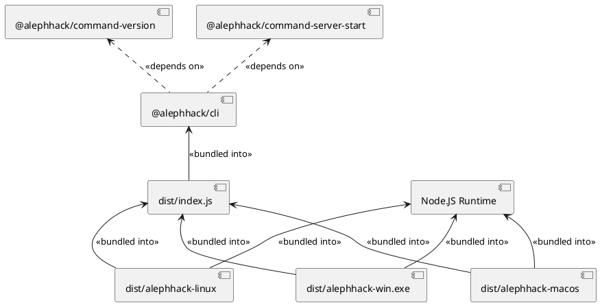

# Deploy Cash - Milestone 1

:::info
This document records our progress of the _first planned milestone_ of the _Deploy Cash_ project. It acts as a journal of our work, and shows the current state of the project on `2024.01.11`.
:::

## Goals

For milestone one, we have decided previously on the following goals, and have managed to accomplish them all:

* 🚀 Set up Node.JS mono-repo
* 🚀 Create a modular, extensible CLI architecture
* 🚀 Implement the POC of the following CLI commands:
    * 🔧 `alephhack server setup` - Initializes a Deploy Cash Server Node
    * 🔧 `alephhack server start` - Starts a Deploy Cash Server Node
    * 🔧 `alephhack server connect` - Connects the local environment to a Server Node
    * 🔧 `alephhack cdn deploy` - Deploys a locally available project to the CDN of the Server Node
    * 🔧 `alephhack cdn undeploy` - Undeploys a CDN deployment from the Server Node
    * 🔧 `alephhack proxy deploy` - Deploys a (not-yet-available) proxy to the Server Node
    * 🔧 `alephhack proxy undeploy` - Undeploys a proxy from the Server Node
    * 🔧 `alephhack proxy serve` - Creates a WebSocket tunnel, through which a proxy deployment can be served
* 🚀 Test and document the POC

# Rundown

:::info
This section contains a detailed rundown of the following:

* Building the project
* Setting up a server node
* Deploying CDN content
* Deploying Proxy content
:::

## Building

The build output of the project is a _Command Line Interface_ application, designed to be run using _Node.JS_. We are using a _module bundler_ to bundle all of the dependencies of the CLI into a single standalone _JS file_. We are also using a _runtime bundler_ to create a portable _executable binary_ from the CLI, that incorporates the Node.JS runtime environment (ready for _Windows_, _Linux_ and _Mac OS_).

:::details PlantUML Diagram of the CLI Architecture



:::

:::details More details about the build pipeline
The project is a mono-repo, consisting of multiple individual _packages_. Each package has its own `package.json` file, and these packages reside in the `packages/` directory. We are using the built-in `workspaces` mechanism of NPM to create the mono-repo workspace.

Each package is first built using _TypeScript_. The TypeScript compilation ensures _type-safety_ throughout the code base, and creates the `compiled/` directory in each package. This directory contains ES5 JavaScript code, which is the transpiled version of the TypeScript code. The TypeScript compiler also creates _type definitions_ in the form of `.d.ts` files, residing in the `types/` directory of each package. Each package's `package.json` file contains a `main` entry, that points to `compiled/index.js`, and a `types` entry, that points to `types/index.d.ts`. These are the "entrypoints" that A) TypeScript will look for when importing the package, and B) the module bundler will look for when bundling the package. We are _fully on purpose_ avoiding either the TypeScript compiler, or the module bundler looking into the original `.ts` code!

The `@alephhack/cli` package contains extra build steps, compared to other packages. It uses the _ESBuild_ module bundler, to create the `dist/index.js` file, which is a standalone runnable, zero-dependency bundled JavaScript application. It can be executed on any Node.JS environment, without installing any dependencies.

The `@alephhack/cli` package has another extra build step, called `package`, that must be invoked separately from the base build pipeline. The `package` process creates _platform-specific single executable binaries_, that incorporate the _Node.JS runtime environment_, and the _bundled JavaScript code_ into a single executable. We use the `pkg` bundler to create these executables.
:::

To build the project, first we have to clone the code. After cloning the code, you can build the project using the following commands. All of these commands assume that you are in the _root directory of the project_.

_1. Install Node.JS dependencies_

```bash
$ npm install
```

_2. Build the standalone JS file_

```bash
$ npm run build
```

_3. Build the executable binary_

```bash
$ npm run package
```

The final runnable executables are located in the `packages/cli/dist` directory:

* `alephhack-linux` - Linux x64 executable
* `alephhack-macos` - Mac OS x64 executable
* `alephhack-win.exe` - Windows x64 executable

:::details Logs of a fresh build

Below are the logs of a freshly executed build, based on commit hash [c692abeb](https://github.com/FrankBevr/DeployCash/commit/c692abeb39c2f47eaec797a09fa13f1794dc3aa3). The complete build takes around ~1 minute on a high-end gaming PC.

```
C:\Users\boton\Downloads\DeployCash-main>npm install

added 318 packages, and audited 330 packages in 12s

47 packages are looking for funding
  run `npm fund` for details

found 0 vulnerabilities

C:\Users\boton\Downloads\DeployCash-main>npm run build

> aleph-hack-2024@0.0.1 build
> npm run build:lib && npm run build:cli


> aleph-hack-2024@0.0.1 build:lib
> npm run -w @alephhack/command-version build && npm run -w @alephhack/command-server-setup build && npm run -w @alephhack/command-server-start build && npm run -w @alephhack/command-server-connect build && npm run -w @alephhack/command-cdn-deploy build && npm run -w @alephhack/command-cdn-undeploy build && npm run -w @alephhack/command-proxy-deploy build && npm run -w @alephhack/command-proxy-undeploy build && npm run -w @alephhack/command-proxy-serve build


> @alephhack/command-version@0.0.1 build
> tsc


> @alephhack/command-server-setup@0.0.1 build
> tsc


> @alephhack/command-server-start@0.0.1 build
> tsc


> @alephhack/command-server-connect@0.0.1 build
> tsc


> @alephhack/command-cdn-deploy@0.0.1 build
> tsc


> @alephhack/command-cdn-undeploy@0.0.1 build
> tsc


> @alephhack/command-proxy-deploy@0.0.1 build
> tsc


> @alephhack/command-proxy-undeploy@0.0.1 build
> tsc


> @alephhack/command-proxy-serve@0.0.1 build
> tsc


> aleph-hack-2024@0.0.1 build:cli
> npm run -w @alephhack/cli build


> @alephhack/cli@0.0.1 build
> npm run build:compile && npm run build:bundle


> @alephhack/cli@0.0.1 build:compile
> tsc


> @alephhack/cli@0.0.1 build:bundle
> esbuild compiled/index.js --bundle --platform=node --target=node20 --outfile=dist/alephhack.js --sourcemap


  dist\alephhack.js      1.7mb ⚠️
  dist\alephhack.js.map  2.8mb

⚡ Done in 377ms

C:\Users\boton\Downloads\DeployCash-main>npm run package

> aleph-hack-2024@0.0.1 package
> npm run -w @alephhack/cli package


> @alephhack/cli@0.0.1 package
> pkg dist/alephhack.js --out-path dist --targets node18-linux-x64,node18-macos-x64,node18-win-x64

> pkg@5.8.1
> Warning Cannot resolve 'mod'
  C:\Users\boton\Downloads\DeployCash-main\packages\cli\dist\alephhack.js
  Dynamic require may fail at run time, because the requested file
  is unknown at compilation time and not included into executable.
  Use a string literal as an argument for 'require', or leave it
  as is and specify the resolved file name in 'scripts' option.
```

:::

## Development Test Run

Everytime we make a modification, the project needs to be rebuilt. After the project has been built, the CLI can be executed in the local development environment using the following command:

```bash
$ npm run cli -- -- <...CLI OPTIONS...>
```

:::warning
**NOTE**, that the command contains **TWO** of the double dashes (`--`)! This is because there are two layers of NPM command delegation, and this is how Node.JS works
:::

:::details CLI version in the local development environment

The following logs are from running a freshly built version of the CLI, using the `npm run cli` command:

```
C:\Users\boton\Downloads\DeployCash-main>npm run cli -- -- version

> aleph-hack-2024@0.0.1 cli
> npm run -w @alephhack/cli start -- version


> @alephhack/cli@0.0.1 start
> node dist/alephhack.js version

0.0.1
```

:::

## Server Node Setup

In this section, we will setup a server node to serve the `*.test.internal` domain. The server node will be running on the `127.0.0.1` loopback address, so this is a "local production deployment" setup.

First, we need to install the _built CLI_ on our system, so that we can run it from the command line. For this rundown, we create a `test` directory, and copy the built binaries to this directory.

Now, we need to make sure, that our subdomains are resolved to the loopback address. Depending on the operating system, the following sections detail how to achieve this.

:::details Resolving `*.test.internal` to `127.0.0.1` on **Windows**
* Open the `C:\Windows\System32\drivers\etc\hosts` file in a text editor
* Add the following lines

```
127.0.0.1 a.test.internal
127.0.0.1 b.test.internal
```

This will make sure, that `a.test.internal` and `b.test.internal` names are resolved to the `127.0.0.1` address. We can validate, that this is working by opening a command prompt, and `ping`ing the names:

```
C:\Users\boton>ping a.test.internal

Pinging a.test.internal [127.0.0.1] with 32 bytes of data:
Reply from 127.0.0.1: bytes=32 time<1ms TTL=128
Reply from 127.0.0.1: bytes=32 time<1ms TTL=128
Reply from 127.0.0.1: bytes=32 time<1ms TTL=128
Reply from 127.0.0.1: bytes=32 time<1ms TTL=128

Ping statistics for 127.0.0.1:
    Packets: Sent = 4, Received = 4, Lost = 0 (0% loss),
Approximate round trip times in milli-seconds:
    Minimum = 0ms, Maximum = 0ms, Average = 0ms

C:\Users\boton>ping b.test.internal

Pinging b.test.internal [127.0.0.1] with 32 bytes of data:
Reply from 127.0.0.1: bytes=32 time<1ms TTL=128
Reply from 127.0.0.1: bytes=32 time<1ms TTL=128
Reply from 127.0.0.1: bytes=32 time<1ms TTL=128
Reply from 127.0.0.1: bytes=32 time<1ms TTL=128

Ping statistics for 127.0.0.1:
    Packets: Sent = 4, Received = 4, Lost = 0 (0% loss),
Approximate round trip times in milli-seconds:
    Minimum = 0ms, Maximum = 0ms, Average = 0ms
```
:::

:::details Resolving `*.test.internal` to `127.0.0.1` on **Linux**
* Open the `/etc/hosts` file in a text editor
* Add the following lines

```
127.0.0.1 a.test.internal
127.0.0.1 b.test.internal
```

This will make sure, that `a.test.internal` and `b.test.internal` names are resolved to the `127.0.0.1` address. We can validate, that this is working by opening a terminal, and `ping`ing the names:

```
tthe@tthe-pc:/mnt/c/Users/boton$ ping -c 1 a.test.internal
PING a.test.internal (127.0.0.1) 56(84) bytes of data.
64 bytes from localhost (127.0.0.1): icmp_seq=1 ttl=64 time=0.016 ms

--- a.test.internal ping statistics ---
1 packets transmitted, 1 received, 0% packet loss, time 0ms
rtt min/avg/max/mdev = 0.016/0.016/0.016/0.000 ms
tthe@tthe-pc:/mnt/c/Users/boton$ ping -c 1 b.test.internal
PING b.test.internal (127.0.0.1) 56(84) bytes of data.
64 bytes from localhost (127.0.0.1): icmp_seq=1 ttl=64 time=0.014 ms

--- b.test.internal ping statistics ---
1 packets transmitted, 1 received, 0% packet loss, time 0ms
rtt min/avg/max/mdev = 0.014/0.014/0.014/0.000 ms
```
:::

Deploy Cash server nodes are designed to work only over HTTPS. Because of this, we need _SSL certificates_ for the domain we are serving from. For a domain accessible over the internet, we can use _LetsEncrypt_, or any other _Certificate Authority_ to obtain a valid SSL certificate. For a local development environment, we can use a self-signed certificate. The certificate needs to be a _wildcard certificate_, and also contain the top-level domain itself in its _Common Name_ field.

:::::details Issuing a self-signed wildcard certificate for `*.test.internal`
* Install `openssl` on your system
* Create a _Certificate Authority_ for signing our certificates

```bash
tthe@tthe-pc:/mnt/c/work/hobby/aleph-hack/test$ openssl genrsa -des3 -passout pass:YourCAPassword -out ca.private.key 2048
tthe@tthe-pc:/mnt/c/work/hobby/aleph-hack/test$ openssl req -x509 -new -nodes -key ca.private.key -sha256 -days 1000 -out ca.cert.pem -passin pass:YourCAPassword -subj "/C=HU/ST=Borsod-Abauj-Zemplen/L=Karancskeszi/O=Your Organization/OU=IT Department/CN=Your Organization CA"
```

:::tip NOTE
Replace `YourCAPassword` with a password of your choice. This password will be used to protect the private key of the CA. Also, replace `Your Organization`, and the other fields with your own values.
:::

* Create an _RSA Key Pair_ for the _server node_. We are creating a _password-protected_ version of the key, and also a _non-password-protected_ version of the key. Both are supported by Deploy Cash Server Node software.

```bash
tthe@tthe-pc:/mnt/c/work/hobby/aleph-hack/test$ openssl genrsa -des3 -passout pass:YourServerKeyPassword -out server.key.secure 2048
tthe@tthe-pc:/mnt/c/work/hobby/aleph-hack/test$ openssl rsa -in server.key.secure -out server.key.nopassword -passin pass:YourServerKeyPassword
writing RSA key
```

:::tip NOTE
Replace `YourServerKeyPassword` with a password of your choice. This password will be used to protect the private key of the server node.
:::

* Create a _Certificate Signing Request_ for the _server node_, using `*.test.internal` as the _Common Name_.

```bash
tthe@tthe-pc:/mnt/c/work/hobby/aleph-hack/test$ openssl req -new -key server.key.nopassword -out server.csr -subj "/C=HU/ST=Borsod-Abauj-Zemplen/L=Karancskeszi/O=Your Organization/OU=Web Security/CN=*.test.internal"
```

:::tip NOTE
Replace `Your Organization`, and the other fields with your own values.
:::

* Now we can sign the _Certificate Signing Request_ using our _Certificate Authority_ to obtain a _wildcard certificate_ for `*.test.internal`.

```bash
tthe@tthe-pc:/mnt/c/work/hobby/aleph-hack/test$ openssl x509 -req -in server.csr -CA ca.cert.pem -CAkey ca.private.key -CAcreateserial -out server.crt -days 1000 -sha256 -passin pass:YourCAPassword
Certificate request self-signature ok
subject=C = HU, ST = Borsod-Abauj-Zemplen, L = Karancskeszi, O = Your Organization, OU = Web Security, CN = *.test.internal
```
:::::

From this point, setting up the server node involves two steps:

* Running the _Server Node Setup_ process, which creates the server node configuration
* Running the _Server Node_ process, which starts the server node

Both the setup, and the actual process requires a `--server-dir` argument, so let's create a directory called `server` inside our `test` directory to hold the _server state files_.

:::::details Creating the `server` directory
```bash
tthe@tthe-pc:/mnt/c/work/hobby/aleph-hack/test$ mkdir server
```
:::::

Now, we can run the _Server Node Setup_ process, which will create the server node directory structure, and the _deploy key_ for the server node.

:::::details Server Node Setup Process
To complete the _one-time server node setup process_, we must run the `alephhack server setup` command.

```bash
tthe@tthe-pc:/mnt/c/work/hobby/aleph-hack/test$ ./alephhack server setup --server-dir $PWD/server --server-domain test.internal
Server setup
serverDir: /mnt/c/work/hobby/aleph-hack/test/server
serverDomain: test.internal
Deploy key for domain  test.internal  is  gajukvajmaeikpelygb5k
Setup complete!
```
:::::

Now, we can run the _Server Node_ process, which will start the server node, and make it available on the `https://*.test.internal` sites.

:::::details Server Node Process

:::tip NOTE
If you are getting `EACCESS: permission denied 0.0.0.0:80` errors, then you need to run the command as an administrator. Use the `sudo` command on Linux, or run the command prompt as an administrator on Windows.
:::

```bash
tthe@tthe-pc:/mnt/c/work/hobby/aleph-hack/test$ sudo ./alephhack server start --server-dir $PWD/server --server-domain test.internal --tls-key-file server.key.nopassword --tls-cert-file server.crt
Server start
httpPort 80
httpsPort 443
wsPort 3000
tlsKeyFile server.key.nopassword
tlsCertFile server.crt
tlsKeyPass
serverDir /mnt/c/work/hobby/aleph-hack/test/server
serverDomain test.internal
Loading deploy key ...
Loaded deploy key.
HTTP server listening on port 80
HTTPS server listening on port 443
WS server listening on port 3000
```
:::::

## Deploying Content

We will now deploy content to the server node. Thanks to the Deploy Cash CLI, deployment of static web applications, and backends is streamlined.

Before deploying, we must connect the server node of the `test.internal` domain to our local CLI. This is done using the `alephhack server connect` command.

:::::details Connecting the CLI to the server node
To connect to the server node, you must obtain the _deploy key_ of the server node, which is printed when performing the _Server Node Setup_ process. In this example, deploy key is `gajukvajmaeikpelygb5k`.

:::tip NOTE
Since we are using self-signed certificates in this example, we must configure Node.JS to **not** reject unauthorized signatures. We can do this by setting the `NODE_TLS_REJECT_UNAUTHORIZED` environment variable to `0`.

```bash
tthe@tthe-pc:/mnt/c/work/hobby/aleph-hack/test$ export NODE_TLS_REJECT_UNAUTHORIZED=0
```
:::

```bash
tthe@tthe-pc:/mnt/c/work/hobby/aleph-hack/test$ ./alephhack server connect --server-domain test.internal --deploy-key gajukvajmaeikpelygb5k --server-ws-port 3000
Server connect
(node:597) Warning: Setting the NODE_TLS_REJECT_UNAUTHORIZED environment variable to '0' makes TLS connections and HTTPS requests insecure by disabling certificate verification.
(Use `alephhack --trace-warnings ...` to show where the warning was created)
WebSocket connection established.
Connected to server successfully!
WebSocket connection closed.
```
:::::

Now, we can use the `alephhack cdn deploy` and `alephhack proxy deploy` commands to deploy content to the server node.

:::::details Example CDN deployment
We will deploy a simple _Hello, world_ HTML application. To do so, we have created a directory called `cdn-app` inside our `test` directory. We have also created an `index.html` file inside this directory with the following content:

```html
<!DOCTYPE html>
<html lang="en">
<head>
    <meta charset="UTF-8">
    <title>Hello, world!</title>
</head>
<body>
    <h1>Hello, world!</h1>
</body>
```

Now, we can deploy this application to the server node using the `alephhack cdn deploy` command. We will deploy from the `cdn-app` directory to the `a.test.internal` domain under the server node (which must be running in the background).

```bash
tthe@tthe-pc:/mnt/c/work/hobby/aleph-hack/test$ ./alephhack cdn deploy --deploy-dir $PWD/cdn-app --deploy-domain a.test.internal
CDN deploy
(node:615) Warning: Setting the NODE_TLS_REJECT_UNAUTHORIZED environment variable to '0' makes TLS connections and HTTPS requests insecure by disabling certificate verification.
(Use `alephhack --trace-warnings ...` to show where the warning was created)
WebSocket connection established.
CDN deploy successful!
WebSocket connection closed.
```

We can verify, that the deployment was successful by opening `https://a.test.internal` in a browser, or using `curl`:

```bash
tthe@tthe-pc:/mnt/c/work/hobby/aleph-hack/test$ curl -X GET -i -v --insecure https://a.test.internal
Note: Unnecessary use of -X or --request, GET is already inferred.
*   Trying 127.0.0.1:443...
* Connected to a.test.internal (127.0.0.1) port 443 (#0)
* ALPN, offering h2
* ALPN, offering http/1.1
* TLSv1.0 (OUT), TLS header, Certificate Status (22):
* TLSv1.3 (OUT), TLS handshake, Client hello (1):
* TLSv1.2 (IN), TLS header, Certificate Status (22):
* TLSv1.3 (IN), TLS handshake, Server hello (2):
* TLSv1.2 (IN), TLS header, Finished (20):
* TLSv1.2 (IN), TLS header, Supplemental data (23):
* TLSv1.3 (IN), TLS handshake, Encrypted Extensions (8):
* TLSv1.2 (IN), TLS header, Supplemental data (23):
* TLSv1.3 (IN), TLS handshake, Certificate (11):
* TLSv1.2 (IN), TLS header, Supplemental data (23):
* TLSv1.3 (IN), TLS handshake, CERT verify (15):
* TLSv1.2 (IN), TLS header, Supplemental data (23):
* TLSv1.3 (IN), TLS handshake, Finished (20):
* TLSv1.2 (OUT), TLS header, Finished (20):
* TLSv1.3 (OUT), TLS change cipher, Change cipher spec (1):
* TLSv1.2 (OUT), TLS header, Supplemental data (23):
* TLSv1.3 (OUT), TLS handshake, Finished (20):
* SSL connection using TLSv1.3 / TLS_AES_256_GCM_SHA384
* ALPN, server accepted to use http/1.1
* Server certificate:
*  subject: C=HU; ST=Borsod-Abauj-Zemplen; L=Karancskeszi; O=Your Organization; OU=Web Security; CN=*.test.internal
*  start date: Jan 17 00:17:17 2024 GMT
*  expire date: Oct 13 00:17:17 2026 GMT
*  issuer: C=HU; ST=Borsod-Abauj-Zemplen; L=Karancskeszi; O=Your Organization; OU=IT Department; CN=Your Organization CA
*  SSL certificate verify result: unable to get local issuer certificate (20), continuing anyway.
* TLSv1.2 (OUT), TLS header, Supplemental data (23):
> GET / HTTP/1.1
> Host: a.test.internal
> User-Agent: curl/7.81.0
> Accept: */*
>
* TLSv1.2 (IN), TLS header, Supplemental data (23):
* TLSv1.3 (IN), TLS handshake, Newsession Ticket (4):
* TLSv1.2 (IN), TLS header, Supplemental data (23):
* TLSv1.3 (IN), TLS handshake, Newsession Ticket (4):
* old SSL session ID is stale, removing
* TLSv1.2 (IN), TLS header, Supplemental data (23):
* Mark bundle as not supporting multiuse
< HTTP/1.1 200 OK
HTTP/1.1 200 OK
< X-Powered-By: Express
X-Powered-By: Express
< Access-Control-Allow-Origin: *
Access-Control-Allow-Origin: *
< Access-Control-Allow-Headers: Accept, Content-Type, Origin, Authorization
Access-Control-Allow-Headers: Accept, Content-Type, Origin, Authorization
< Access-Control-Allow-Methods: GET, OPTIONS
Access-Control-Allow-Methods: GET, OPTIONS
< Accept-Ranges: bytes
Accept-Ranges: bytes
< Cache-Control: public, max-age=0
Cache-Control: public, max-age=0
< Last-Modified: Wed, 17 Jan 2024 00:49:14 GMT
Last-Modified: Wed, 17 Jan 2024 00:49:14 GMT
< ETag: W/"96-18d14e4c8cd"
ETag: W/"96-18d14e4c8cd"
< Content-Type: text/html; charset=UTF-8
Content-Type: text/html; charset=UTF-8
< Content-Length: 150
Content-Length: 150
< Date: Wed, 17 Jan 2024 00:49:48 GMT
Date: Wed, 17 Jan 2024 00:49:48 GMT
< Connection: keep-alive
Connection: keep-alive
< Keep-Alive: timeout=5
Keep-Alive: timeout=5

<
<!DOCTYPE html>
<html lang="en">
<head>
    <meta charset="UTF-8">
    <title>Hello, world!</title>
</head>
<body>
    <h1>Hello, world!</h1>
</body>
* Connection #0 to host a.test.internal left intact
```
:::::

:::::details Example Proxy deployment
Proxy deployment is a two-step process:

* First we deploy a _pending proxy_ to the server node
* Then, we start the CLI in _proxy serve mode_, which creates a WebSocket tunnel to the server node, through which the proxy deployment can be served

To create the pending proxy, we use the `alephhack proxy deploy` command. We will deploy a proxy deployment to the `b.test.internal` domain.

```bash
tthe@tthe-pc:/mnt/c/work/hobby/aleph-hack/test$ ./alephhack proxy deploy --domain b.test.internal
Proxy Deploy
(node:673) Warning: Setting the NODE_TLS_REJECT_UNAUTHORIZED environment variable to '0' makes TLS connections and HTTPS requests insecure by disabling certificate verification.
(Use `alephhack --trace-warnings ...` to show where the warning was created)
WebSocket connection established.
Proxy deploy successful!
WebSocket connection closed.
```

Now, we will start a very simple backend on our local development machine. This backend will return a constant JSON response using _Node.JS_, and _express_. Our backend will be listening on port `4000` on our _local machine_ only. The code of this backend is the following (saved to `test/backend.js`):

```js
const express = require('express');
const app = express();

app.get('/', (req, res) => {
    res.json({
        message: 'Hello, world!'
    });
});

app.listen(4000, () => {
    console.log('Listening on port 4000');
});
```

Now, we can start our backend using the following command:

```bash
tthe@tthe-pc:/mnt/c/work/hobby/aleph-hack/test$ node backend.js
Listening on port 4000
```

To serve this backend through the proxy deployment, we must start the CLI in _proxy serve mode_. This is done using the `alephhack proxy serve` command. We will serve the our backend from local port `4000` to `b.test.internal` domain.

```bash
tthe@tthe-pc:/mnt/c/work/hobby/aleph-hack/test$ ./alephhack proxy serve --domain b.test.internal --host 127.0.0.1 --port 4000
Proxy Serve
(node:930) Warning: Setting the NODE_TLS_REJECT_UNAUTHORIZED environment variable to '0' makes TLS connections and HTTPS requests insecure by disabling certificate verification.
(Use `alephhack --trace-warnings ...` to show where the warning was created)
WebSocket connection established.
Now listening for requests...
Handshake complete.
```

Now, we can verify, that the proxy deployment is working by opening `https://b.test.internal` in a browser, or using `curl`:

```bash
Note: Unnecessary use of -X or --request, GET is already inferred.
*   Trying 127.0.0.1:443...
* Connected to b.test.internal (127.0.0.1) port 443 (#0)
* ALPN, offering h2
* ALPN, offering http/1.1
* TLSv1.0 (OUT), TLS header, Certificate Status (22):
* TLSv1.3 (OUT), TLS handshake, Client hello (1):
* TLSv1.2 (IN), TLS header, Certificate Status (22):
* TLSv1.3 (IN), TLS handshake, Server hello (2):
* TLSv1.2 (IN), TLS header, Finished (20):
* TLSv1.2 (IN), TLS header, Supplemental data (23):
* TLSv1.3 (IN), TLS handshake, Encrypted Extensions (8):
* TLSv1.2 (IN), TLS header, Supplemental data (23):
* TLSv1.3 (IN), TLS handshake, Certificate (11):
* TLSv1.2 (IN), TLS header, Supplemental data (23):
* TLSv1.3 (IN), TLS handshake, CERT verify (15):
* TLSv1.2 (IN), TLS header, Supplemental data (23):
* TLSv1.3 (IN), TLS handshake, Finished (20):
* TLSv1.2 (OUT), TLS header, Finished (20):
* TLSv1.3 (OUT), TLS change cipher, Change cipher spec (1):
* TLSv1.2 (OUT), TLS header, Supplemental data (23):
* TLSv1.3 (OUT), TLS handshake, Finished (20):
* SSL connection using TLSv1.3 / TLS_AES_256_GCM_SHA384
* ALPN, server accepted to use http/1.1
* Server certificate:
*  subject: C=HU; ST=Borsod-Abauj-Zemplen; L=Karancskeszi; O=Your Organization; OU=Web Security; CN=*.test.internal
*  start date: Jan 17 00:17:17 2024 GMT
*  expire date: Oct 13 00:17:17 2026 GMT
*  issuer: C=HU; ST=Borsod-Abauj-Zemplen; L=Karancskeszi; O=Your Organization; OU=IT Department; CN=Your Organization CA
*  SSL certificate verify result: unable to get local issuer certificate (20), continuing anyway.
* TLSv1.2 (OUT), TLS header, Supplemental data (23):
> GET / HTTP/1.1
> Host: b.test.internal
> User-Agent: curl/7.81.0
> Accept: */*
>
* TLSv1.2 (IN), TLS header, Supplemental data (23):
* TLSv1.3 (IN), TLS handshake, Newsession Ticket (4):
* TLSv1.2 (IN), TLS header, Supplemental data (23):
* TLSv1.3 (IN), TLS handshake, Newsession Ticket (4):
* old SSL session ID is stale, removing
* TLSv1.2 (IN), TLS header, Supplemental data (23):
* Mark bundle as not supporting multiuse
< HTTP/1.1 200 OK
HTTP/1.1 200 OK
< x-powered-by: Express
x-powered-by: Express
< Content-Type: application/json; charset=utf-8
Content-Type: application/json; charset=utf-8
< Content-Length: 27
Content-Length: 27
< etag: W/"1b-tDnArHZ232y12bSoTiMc+/cz4as"
etag: W/"1b-tDnArHZ232y12bSoTiMc+/cz4as"
< date: Wed, 17 Jan 2024 00:55:57 GMT
date: Wed, 17 Jan 2024 00:55:57 GMT
< connection: close
connection: close

<
* Closing connection 0
* TLSv1.2 (OUT), TLS header, Supplemental data (23):
* TLSv1.3 (OUT), TLS alert, close notify (256):
{"message":"Hello, world!"}
```
:::::
