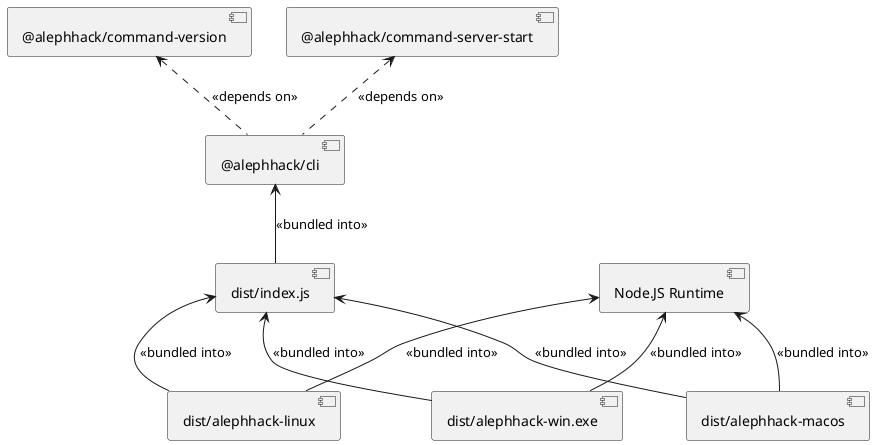

# Deploy Cash - Milestone 1

:::info
This document records our progress of the _first planned milestone_ of the _Deploy Cash_ project. It acts as a journal of our work, and shows the current state of the project on `2024.01.11`.
:::

## Goals

For milestone one, we have decided previously on the following goals, and have managed to accomplish them all:

* 🚀 Set up Node.JS mono-repo
* 🚀 Create a modular, extensible CLI architecture
* 🚀 Implement the POC of the following CLI commands:
    * 🔧 `alephhack server setup` - Initializes a Deploy Cash Server Node
    * 🔧 `alephhack server start` - Starts a Deploy Cash Server Node
    * 🔧 `alephhack server connect` - Connects the local environment to a Server Node
    * 🔧 `alephhack cdn deploy` - Deploys a locally available project to the CDN of the Server Node
    * 🔧 `alephhack cdn undeploy` - Undeploys a CDN deployment from the Server Node
    * 🔧 `alephhack proxy deploy` - Deploys a (not-yet-available) proxy to the Server Node
    * 🔧 `alephhack proxy undeploy` - Undeploys a proxy from the Server Node
    * 🔧 `alephhack proxy serve` - Creates a WebSocket tunnel, through which a proxy deployment can be served
* 🚀 Test and document the POC

## Rundown

:::info
This section contains a detailed rundown of the following:

* Building the project
* Setting up a server node
* Deploying CDN content
* Deploying Proxy content
:::

### Building

The build output of the project is a _Command Line Interface_ application, designed to be run using _Node.JS_. We are using a _module bundler_ to bundle all of the dependencies of the CLI into a single standalone _JS file_. We are also using a _runtime bundler_ to create a portable _executable binary_ from the CLI, that incorporates the Node.JS runtime environment (ready for _Windows_, _Linux_ and _Mac OS_).

:::details PlantUML Diagram of the CLI Architecture



:::

:::details More details about the build pipeline
The project is a mono-repo, consisting of multiple individual _packages_. Each package has its own `package.json` file, and these packages reside in the `packages/` directory. We are using the built-in `workspaces` mechanism of NPM to create the mono-repo workspace.

Each package is first built using _TypeScript_. The TypeScript compilation ensures _type-safety_ throughout the code base, and creates the `compiled/` directory in each package. This directory contains ES5 JavaScript code, which is the transpiled version of the TypeScript code. The TypeScript compiler also creates _type definitions_ in the form of `.d.ts` files, residing in the `types/` directory of each package. Each package's `package.json` file contains a `main` entry, that points to `compiled/index.js`, and a `types` entry, that points to `types/index.d.ts`. These are the "entrypoints" that A) TypeScript will look for when importing the package, and B) the module bundler will look for when bundling the package. We are _fully on purpose_ avoiding either the TypeScript compiler, or the module bundler looking into the original `.ts` code!

The `@alephhack/cli` package contains extra build steps, compared to other packages. It uses the _ESBuild_ module bundler, to create the `dist/index.js` file, which is a standalone runnable, zero-dependency bundled JavaScript application. It can be executed on any Node.JS environment, without installing any dependencies.

The `@alephhack/cli` package has another extra build step, called `package`, that must be invoked separately from the base build pipeline. The `package` process creates _platform-specific single executable binaries_, that incorporate the _Node.JS runtime environment_, and the _bundled JavaScript code_ into a single executable. We use the `pkg` bundler to create these executables.
:::

To build the project, first we have to clone the code. After cloning the code, you can build the project using the following commands. All of these commands assume that you are in the _root directory of the project_.

_1. Install Node.JS dependencies_

```bash
$ npm install
```

_2. Build the standalone JS file_

```bash
$ npm run build
```

_3. Build the executable binary_

```bash
$ npm run package
```

The final runnable executables are located in the `packages/cli/dist` directory:

* `alephhack-linux` - Linux x64 executable
* `alephhack-macos` - Mac OS x64 executable
* `alephhack-win.exe` - Windows x64 executable

:::details Logs of a fresh build

Below are the logs of a freshly executed build, based on commit hash [c692abeb](https://github.com/FrankBevr/DeployCash/commit/c692abeb39c2f47eaec797a09fa13f1794dc3aa3). The complete build takes around ~1 minute on a high-end gaming PC.

```
C:\Users\boton\Downloads\DeployCash-main>npm install

added 318 packages, and audited 330 packages in 12s

47 packages are looking for funding
  run `npm fund` for details

found 0 vulnerabilities

C:\Users\boton\Downloads\DeployCash-main>npm run build

> aleph-hack-2024@0.0.1 build
> npm run build:lib && npm run build:cli


> aleph-hack-2024@0.0.1 build:lib
> npm run -w @alephhack/command-version build && npm run -w @alephhack/command-server-setup build && npm run -w @alephhack/command-server-start build && npm run -w @alephhack/command-server-connect build && npm run -w @alephhack/command-cdn-deploy build && npm run -w @alephhack/command-cdn-undeploy build && npm run -w @alephhack/command-proxy-deploy build && npm run -w @alephhack/command-proxy-undeploy build && npm run -w @alephhack/command-proxy-serve build


> @alephhack/command-version@0.0.1 build
> tsc


> @alephhack/command-server-setup@0.0.1 build
> tsc


> @alephhack/command-server-start@0.0.1 build
> tsc


> @alephhack/command-server-connect@0.0.1 build
> tsc


> @alephhack/command-cdn-deploy@0.0.1 build
> tsc


> @alephhack/command-cdn-undeploy@0.0.1 build
> tsc


> @alephhack/command-proxy-deploy@0.0.1 build
> tsc


> @alephhack/command-proxy-undeploy@0.0.1 build
> tsc


> @alephhack/command-proxy-serve@0.0.1 build
> tsc


> aleph-hack-2024@0.0.1 build:cli
> npm run -w @alephhack/cli build


> @alephhack/cli@0.0.1 build
> npm run build:compile && npm run build:bundle


> @alephhack/cli@0.0.1 build:compile
> tsc


> @alephhack/cli@0.0.1 build:bundle
> esbuild compiled/index.js --bundle --platform=node --target=node20 --outfile=dist/alephhack.js --sourcemap


  dist\alephhack.js      1.7mb ⚠️
  dist\alephhack.js.map  2.8mb

⚡ Done in 377ms

C:\Users\boton\Downloads\DeployCash-main>npm run package

> aleph-hack-2024@0.0.1 package
> npm run -w @alephhack/cli package


> @alephhack/cli@0.0.1 package
> pkg dist/alephhack.js --out-path dist --targets node18-linux-x64,node18-macos-x64,node18-win-x64

> pkg@5.8.1
> Warning Cannot resolve 'mod'
  C:\Users\boton\Downloads\DeployCash-main\packages\cli\dist\alephhack.js
  Dynamic require may fail at run time, because the requested file
  is unknown at compilation time and not included into executable.
  Use a string literal as an argument for 'require', or leave it
  as is and specify the resolved file name in 'scripts' option.
```

:::

### Development Test Run

Everytime we make a modification, the project needs to be rebuilt. After the project has been built, the CLI can be executed in the local development environment using the following command:

```bash
$ npm run cli -- -- <...CLI OPTIONS...>
```

:::warning
**NOTE**, that the command contains **TWO** of the double dashes (`--`)! This is because there are two layers of NPM command delegation, and this is how Node.JS works
:::

:::details CLI version in the local development environment

The following logs are from running a freshly built version of the CLI, using the `npm run cli` command:

```
C:\Users\boton\Downloads\DeployCash-main>npm run cli -- -- version

> aleph-hack-2024@0.0.1 cli
> npm run -w @alephhack/cli start -- version


> @alephhack/cli@0.0.1 start
> node dist/alephhack.js version

0.0.1
```
